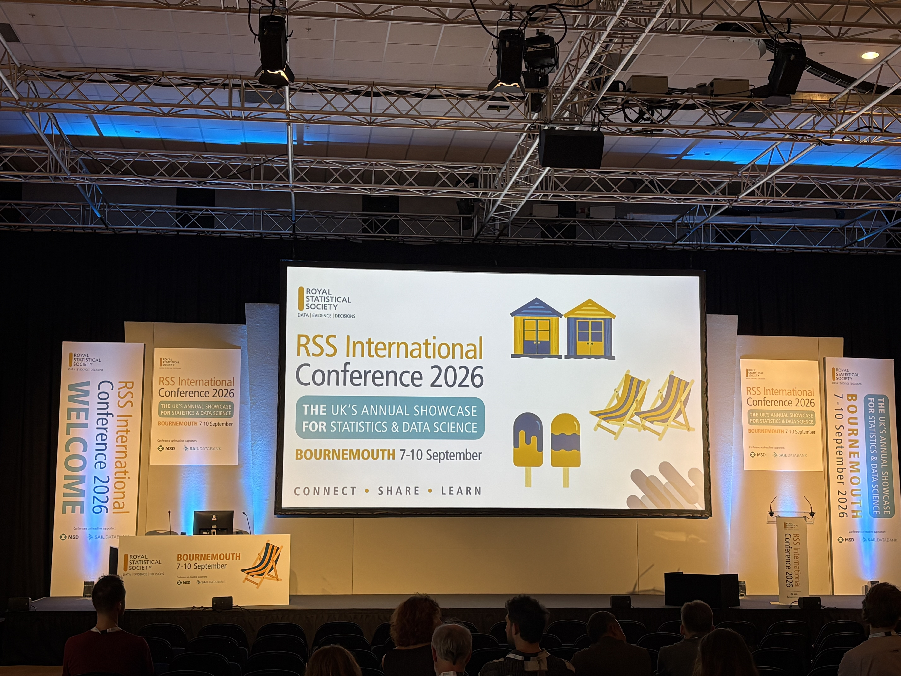
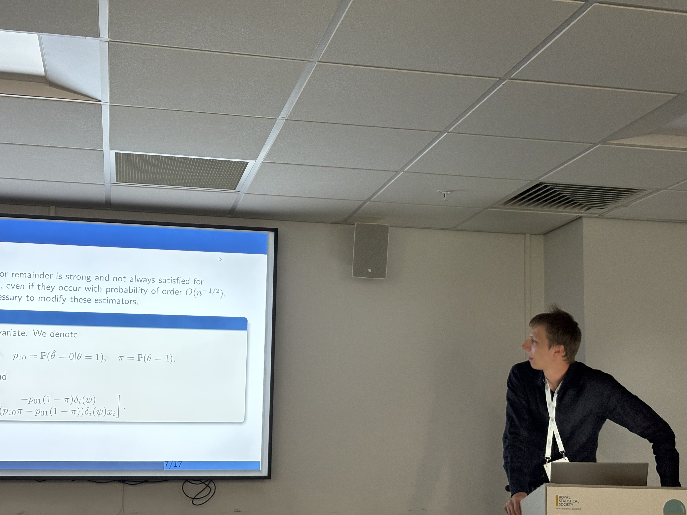
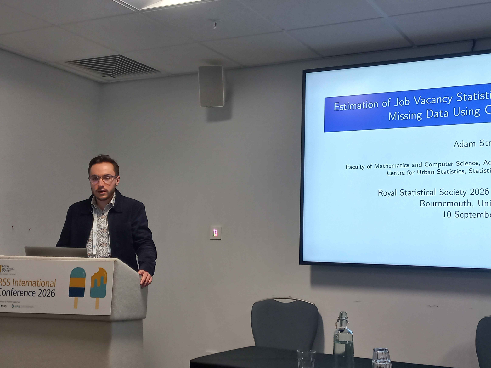

::: {.panel-tabset}

## Polski

W dniach 7–10 września 2026 r. Adam Struzik i Michał Warmuz z OJALAB uczestniczyli w międzynarodowej konferencji naukowej „Royal Statistical Society International Conference 2026” w Bournemouth (Zjednoczone Królestwo). Wydarzenie zgromadziło ok. 650 statystyków i analityków danych z ponad 40 krajów.

W referatach konferencyjnych omawiano różne aspekty statystyki. Liczną grupę prezentacji stanowiły te skupiające się na metodach matematycznych, np. służących do radzenia sobie z brakami danych. W sesjach poświęconych statystyce publicznej badacze przedstawiali propozycje wykorzystania niekonwencjonalnych źródeł danych, np. systemu GPS czy telefonii komórkowej. Istotną część konferencji tworzyły warsztaty związane z oprogramowaniem. Szczególnie istotne dla projektu OJALAB były te dotyczące nowego zintegrowanego środowiska programistycznego do analizy danych Positron oraz narzędzia do przetwarzania dużych zbiorów danych DuckDB.

Nie mogło też zabraknąć tematu sztucznej inteligencji. Omówiono proces wdrażania takich technologii w instytucjach statystycznych, a także podkreślono konieczność właściwej i dogłębnej walidacji. W tym duchu zwrócono uwagę na rolę człowieka w statystyce. Kilku zaproszonych prelegentów wskazywało na znaczenie gruntownego zrozumienia problemów badawczych, a także na krytyczne myślenie i etykę zawodową.

Podczas konferencji obaj reprezentanci projektu OJALAB zaprezentowali wyniki prac zespołu. W sesji „Adjusting for bias, measurement error and attrition” Michał Warmuz przedstawił referat „Bias Corrections for GLMs with Misclassified Covariates”. **#TODO**

W sesji „Hidden Counts & Job Amounts” Adam Struzik wygłosił prezentację „Estimation of Job Vacancy Statistics Under Misclassification and Missing Data Using Capture-Recapture”. Przedstawił w niej propozycję podejścia służącego do estymacji liczby wakatów, które wykorzystuje wyłącznie dane z internetowych ogłoszeń o pracę i rejestrów administracyjnych. Metoda opiera się na technikach złapania i ponownego złapania (ang. *capture-recapture*) oraz analizy klas ukrytych. Jej kluczowym elementem jest to, że dopuszcza błędy klasyfikacji w zmiennych kategorialnych oraz obsługuje wartości brakujące i cenzurowane.

## English

Between 7 and 10 September 2026, Adam Struzik and Michał Warmuz from OJALAB took part in the "Royal Statistical Society International Conference 2026" in Bournemouth, United Kingdom. The event gathered about 650 statisticians and data scientists from over 40 countries.

Presentations at the conference discussed various aspects of statistics. A large number of talks focused on mathematical methodology, for example for addressing missing data. In sessions for official statistics, researchers proposed using unconventional data sources, such as GPS or mobile phone records. Another important part of the conference consisted of software workshops. Particularly important for the OJALAB project were those presenting Positron, a new integrated development environment (IDE) for data science, and DuckDB, a tool for processing large datasets.

The topic of artificial intelligence (AI) could not be omitted either. Researchers investigated the adoption of such technologies in statistical institutions and highlighted the need for proper and thorough validation. In this spirit, the human role in statistics was emphasised. Several keynote speakers pointed to the importance of a deep understanding of research problems, as well as critical thinking and professional ethics.

At the conference, both OJALAB delegates presented the outputs of the project. In the session "Adjusting for bias, measurement error and attrition", Michał Warmuz gave a talk entitled "Bias Corrections for GLMs with Misclassified Covariates". **#TODO**

In the session "Hidden Counts & Job Amounts", Adam Struzik presented the paper "Estimation of Job Vacancy Statistics Under Misclassification and Missing Data Using Capture-Recapture". The talk introduced a proof-of-concept approach for estimating the number of job vacancies using only data from online job advertisements (OJAs) and administrative registers. The method is based on capture-recapture and latent class analysis techniques. Its key feature is that it accounts for classification errors in categorical covariates (such as occupation codes) and allows for missing and censored data.

:::

{width="60%" fig-align="center"}

{width="60%" fig-align="center"}

{width="60%" fig-align="center"}
